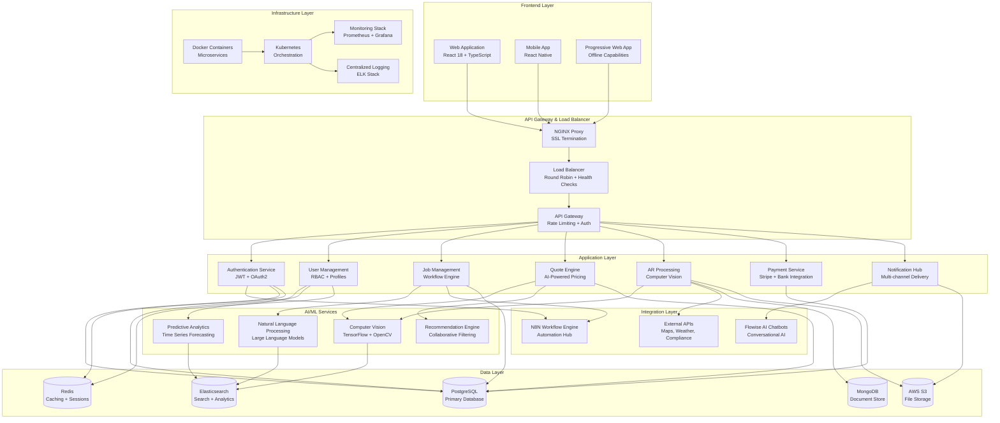

# 🏗️ TECHNICAL ARCHITECTURE - BIPED MARKET DOMINATION STRATEGY 2025

## Overview
This document outlines the comprehensive technical architecture for the Biped platform's revolutionary features. The architecture is designed for scalability, security, and maintainability, supporting AI-powered automation, AR-to-Design workflows, and autonomous business management at enterprise scale.

---

## 🎯 ARCHITECTURE PRINCIPLES

### Core Design Principles
- **Microservices Architecture**: Modular, independently deployable services
- **Event-Driven Design**: Asynchronous communication and real-time updates
- **Cloud-Native**: Containerized, auto-scaling, and resilient infrastructure
- **Security-First**: Zero-trust architecture with comprehensive audit trails
- **API-First**: RESTful APIs with GraphQL for complex queries
- **Performance-Optimized**: Sub-second response times with intelligent caching

### Scalability Goals
- **Horizontal Scaling**: Support 100K+ concurrent users
- **Geographic Distribution**: Multi-region deployment capability
- **Database Sharding**: Partitioned data for optimal performance
- **CDN Integration**: Global content delivery for AR assets
- **Auto-scaling**: Dynamic resource allocation based on demand

---

## 🏗️ SYSTEM ARCHITECTURE DIAGRAM



---

## 🔧 MICROSERVICES BREAKDOWN

### 1. Authentication & Authorization Service
```yaml
Service: auth-service
Technology: Node.js + Express + JWT
Database: PostgreSQL + Redis
Scale: 3 replicas minimum

Responsibilities:
  - User authentication (email/password, OAuth2, SSO)
  - JWT token generation and validation
  - Password reset and security policies
  - Session management with Redis
  - Multi-factor authentication support
  - Role-based access control (RBAC)

API Endpoints:
  POST /auth/login
  POST /auth/logout
  POST /auth/refresh
  POST /auth/register
  PUT /auth/password/reset
  GET /auth/profile
  POST /auth/mfa/setup
  POST /auth/mfa/verify

Security Features:
  - Password hashing with bcrypt + salt
  - Rate limiting (5 attempts per minute)
  - Account lockout after failed attempts
  - Audit logging for all auth events
  - IP-based geo-blocking for suspicious activity
```

### 2. User Management Service
```yaml
Service: user-service
Technology: Python + FastAPI
Database: PostgreSQL
Scale: 5 replicas minimum

Responsibilities:
  - User profile management
  - Role and permission assignment
  - User preferences and settings
  - Avatar and document storage
  - User verification and KYC
  - Communication preferences

API Endpoints:
  GET /users/profile
  PUT /users/profile
  GET /users/{id}/permissions
  PUT /users/{id}/role
  POST /users/verification
  GET /users/preferences
  PUT /users/preferences

Data Models:
  - User: id, email, name, role, status, created_at
  - Profile: user_id, avatar, bio, location, preferences
  - Permission: id, name, description, resource, action
  - Role: id, name, permissions[], hierarchical_level
```

### 3. Job Management Service
```yaml
Service: job-service
Technology: Python + Django + Celery
Database: PostgreSQL + Redis (queue)
Scale: 10 replicas minimum

Responsibilities:
  - Job posting and management
  - Quote request processing
  - Project timeline management
  - Status tracking and updates
  - Team assignment and coordination
  - Progress reporting and milestones

API Endpoints:
  POST /jobs/create
  GET /jobs/search
  PUT /jobs/{id}/status
  GET /jobs/{id}/timeline
  POST /jobs/{id}/assign
  GET /jobs/dashboard
  PUT /jobs/{id}/progress

Workflow Engine:
  - State machine for job lifecycle
  - Automatic status transitions
  - Deadline monitoring and alerts
  - Resource allocation optimization
  - Quality checkpoint enforcement
```

### 4. AR Processing Service
```yaml
Service: ar-service
Technology: Python + TensorFlow + OpenCV
Database: MongoDB + AWS S3
Scale: 8 replicas minimum (GPU-enabled)

Responsibilities:
  - AR image processing and analysis
  - 3D space reconstruction
  - Material identification
  - Measurement extraction
  - Quality assessment
  - Progress tracking via photos

API Endpoints:
  POST /ar/scan/upload
  GET /ar/scan/{id}/analysis
  POST /ar/scan/process
  GET /ar/measurements/{id}
  POST /ar/materials/identify
  GET /ar/progress/{job_id}

AI Models:
  - Object detection: YOLOv8 custom trained
  - Semantic segmentation: DeepLabV3+
  - Depth estimation: MiDaS model
  - Material classification: ResNet50 fine-tuned
  - Measurement extraction: Custom CNN + geometry
```

### 5. Quote Generation Service
```yaml
Service: quote-service
Technology: Python + FastAPI + ML Pipeline
Database: PostgreSQL + Redis (pricing cache)
Scale: 6 replicas minimum

Responsibilities:
  - AI-powered price calculation
  - Material cost estimation
  - Labor time prediction
  - Market rate optimization
  - Quote generation and formatting
  - Pricing analytics and insights

API Endpoints:
  POST /quotes/generate
  GET /quotes/{id}
  PUT /quotes/{id}/accept
  GET /quotes/history
  POST /quotes/customize
  GET /quotes/analytics

Pricing Engine:
  - Machine learning models for cost prediction
  - Real-time market data integration
  - Historical pricing analysis
  - Regional cost adjustments
  - Competitor pricing intelligence
  - Dynamic pricing optimization
```

### 6. Payment Processing Service
```yaml
Service: payment-service
Technology: Node.js + Express + Stripe SDK
Database: PostgreSQL (encrypted)
Scale: 4 replicas minimum

Responsibilities:
  - Payment processing and billing
  - Invoice generation and management
  - Subscription billing
  - Refund and dispute handling
  - Financial reporting
  - Tax calculation and compliance

API Endpoints:
  POST /payments/process
  POST /payments/invoice
  GET /payments/history
  POST /payments/refund
  GET /payments/billing
  PUT /payments/subscription

Security Features:
  - PCI DSS compliance
  - End-to-end encryption
  - Tokenized payment methods
  - Fraud detection integration
  - Audit trail for all transactions
  - Multi-currency support
```

### 7. Notification Service
```yaml
Service: notification-service
Technology: Node.js + WebSocket + Push APIs
Database: MongoDB + Redis (real-time queue)
Scale: 5 replicas minimum

Responsibilities:
  - Multi-channel notification delivery
  - Real-time push notifications
  - Email and SMS campaigns
  - Notification preferences management
  - Delivery tracking and analytics
  - Template management

API Endpoints:
  POST /notifications/send
  GET /notifications/inbox
  PUT /notifications/{id}/read
  POST /notifications/preferences
  GET /notifications/analytics
  POST /notifications/template

Delivery Channels:
  - Web push notifications
  - Mobile push (FCM/APNS)
  - Email (SendGrid/SES)
  - SMS (Twilio)
  - In-app notifications
  - Slack/Teams integration
```

---

## 🤖 AI/ML SERVICES ARCHITECTURE

### Computer Vision Pipeline
```python
# AR Image Processing Pipeline
class ARImageProcessor:
    def __init__(self):
        self.object_detector = YOLOv8Model('construction_objects_v2.pt')
        self.depth_estimator = MiDaSModel('dpt_hybrid_384.pt')
        self.material_classifier = ResNet50Model('materials_v3.h5')
        self.measurement_extractor = CustomMeasurementCNN()
    
    async def process_ar_scan(self, image_data: bytes, metadata: dict) -> ARAnalysis:
        # Object detection and segmentation
        objects = await self.object_detector.detect(image_data)
        
        # Depth estimation for 3D reconstruction
        depth_map = await self.depth_estimator.estimate_depth(image_data)
        
        # Material identification
        materials = await self.material_classifier.classify_materials(
            image_data, objects
        )
        
        # Measurement extraction
        measurements = await self.measurement_extractor.extract_measurements(
            image_data, depth_map, objects
        )
        
        return ARAnalysis(
            objects=objects,
            depth_map=depth_map,
            materials=materials,
            measurements=measurements,
            confidence_score=self.calculate_confidence(objects, depth_map)
        )

# Pricing Prediction Model
class PricingEngine:
    def __init__(self):
        self.cost_predictor = XGBoostModel('cost_prediction_v4.pkl')
        self.time_estimator = LSTMModel('time_estimation_v2.h5')
        self.market_analyzer = MarketDataAnalyzer()
    
    async def generate_quote(self, job_data: JobData, ar_analysis: ARAnalysis) -> Quote:
        # Feature engineering from AR analysis and job data
        features = self.extract_features(job_data, ar_analysis)
        
        # Predict material costs
        material_costs = await self.cost_predictor.predict_costs(features)
        
        # Estimate labor time and costs
        labor_time = await self.time_estimator.predict_time(features)
        labor_costs = self.calculate_labor_costs(labor_time, job_data.location)
        
        # Market rate adjustments
        market_rates = await self.market_analyzer.get_current_rates(
            job_data.category, job_data.location
        )
        
        return Quote(
            materials=material_costs,
            labor=labor_costs,
            market_adjustments=market_rates,
            total=self.calculate_total(material_costs, labor_costs, market_rates),
            confidence=self.calculate_prediction_confidence(features)
        )
```

### Natural Language Processing
```python
# Flowise AI Integration
class FlowiseAIService:
    def __init__(self):
        self.chat_model = ChatOpenAI(model_name="gpt-4-turbo")
        self.embeddings = OpenAIEmbeddings()
        self.vector_store = PineconeVectorStore()
        self.memory = ConversationBufferWindowMemory(k=10)
    
    async def process_customer_query(self, query: str, context: dict) -> AIResponse:
        # Retrieve relevant context from knowledge base
        relevant_docs = await self.vector_store.similarity_search(query, k=5)
        
        # Construct prompt with context
        prompt = self.build_prompt(query, relevant_docs, context)
        
        # Generate response
        response = await self.chat_model.agenerate([prompt])
        
        # Extract actions if any
        actions = self.extract_actions(response.generations[0].text)
        
        return AIResponse(
            text=response.generations[0].text,
            actions=actions,
            confidence=response.llm_output.get('confidence', 0.8),
            sources=relevant_docs
        )

# Predictive Analytics
class PredictiveAnalytics:
    def __init__(self):
        self.demand_forecaster = ProphetModel()
        self.revenue_predictor = ARIMAModel()
        self.churn_predictor = GradientBoostingModel()
    
    async def generate_forecasts(self, timeframe: str) -> ForecastData:
        # Demand forecasting
        demand_forecast = await self.demand_forecaster.forecast(
            timeframe, include_holidays=True
        )
        
        # Revenue prediction
        revenue_forecast = await self.revenue_predictor.predict(
            steps=self.timeframe_to_steps(timeframe)
        )
        
        # Customer churn prediction
        churn_risks = await self.churn_predictor.predict_churn_probability()
        
        return ForecastData(
            demand=demand_forecast,
            revenue=revenue_forecast,
            churn_risks=churn_risks,
            recommendations=self.generate_recommendations(
                demand_forecast, revenue_forecast, churn_risks
            )
        )
```

---

## 🗄️ DATABASE ARCHITECTURE

### PostgreSQL Schema Design
```sql
-- Users and Authentication
CREATE TABLE users (
    id UUID PRIMARY KEY DEFAULT gen_random_uuid(),
    email VARCHAR(255) UNIQUE NOT NULL,
    password_hash VARCHAR(255) NOT NULL,
    role_id INTEGER REFERENCES roles(id),
    status VARCHAR(20) DEFAULT 'active',
    email_verified BOOLEAN DEFAULT FALSE,
    created_at TIMESTAMP DEFAULT CURRENT_TIMESTAMP,
    updated_at TIMESTAMP DEFAULT CURRENT_TIMESTAMP
);

CREATE TABLE roles (
    id SERIAL PRIMARY KEY,
    name VARCHAR(50) UNIQUE NOT NULL,
    description TEXT,
    permissions JSONB DEFAULT '[]',
    hierarchical_level INTEGER DEFAULT 0
);

CREATE TABLE user_profiles (
    user_id UUID PRIMARY KEY REFERENCES users(id),
    first_name VARCHAR(100),
    last_name VARCHAR(100),
    avatar_url TEXT,
    bio TEXT,
    location JSONB,
    preferences JSONB DEFAULT '{}',
    verification_status VARCHAR(20) DEFAULT 'pending'
);

-- Job Management
CREATE TABLE jobs (
    id UUID PRIMARY KEY DEFAULT gen_random_uuid(),
    customer_id UUID REFERENCES users(id),
    title VARCHAR(255) NOT NULL,
    description TEXT,
    category_id INTEGER REFERENCES service_categories(id),
    status VARCHAR(20) DEFAULT 'pending',
    priority VARCHAR(10) DEFAULT 'medium',
    location JSONB NOT NULL,
    budget_min DECIMAL(12,2),
    budget_max DECIMAL(12,2),
    timeline JSONB,
    requirements JSONB DEFAULT '{}',
    ar_scan_data JSONB,
    created_at TIMESTAMP DEFAULT CURRENT_TIMESTAMP,
    updated_at TIMESTAMP DEFAULT CURRENT_TIMESTAMP
);

CREATE TABLE job_assignments (
    id UUID PRIMARY KEY DEFAULT gen_random_uuid(),
    job_id UUID REFERENCES jobs(id),
    provider_id UUID REFERENCES users(id),
    role VARCHAR(50) NOT NULL,
    assigned_at TIMESTAMP DEFAULT CURRENT_TIMESTAMP,
    status VARCHAR(20) DEFAULT 'assigned'
);

-- Quote Management
CREATE TABLE quotes (
    id UUID PRIMARY KEY DEFAULT gen_random_uuid(),
    job_id UUID REFERENCES jobs(id),
    provider_id UUID REFERENCES users(id),
    quote_number VARCHAR(50) UNIQUE,
    total_amount DECIMAL(12,2) NOT NULL,
    breakdown JSONB NOT NULL,
    valid_until TIMESTAMP,
    status VARCHAR(20) DEFAULT 'pending',
    ai_generated BOOLEAN DEFAULT FALSE,
    confidence_score DECIMAL(3,2),
    created_at TIMESTAMP DEFAULT CURRENT_TIMESTAMP
);

-- AR Processing
CREATE TABLE ar_scans (
    id UUID PRIMARY KEY DEFAULT gen_random_uuid(),
    job_id UUID REFERENCES jobs(id),
    user_id UUID REFERENCES users(id),
    image_urls TEXT[] NOT NULL,
    analysis_data JSONB,
    measurements JSONB,
    materials_detected JSONB,
    processing_status VARCHAR(20) DEFAULT 'processing',
    confidence_score DECIMAL(3,2),
    created_at TIMESTAMP DEFAULT CURRENT_TIMESTAMP
);

-- Payments and Billing
CREATE TABLE invoices (
    id UUID PRIMARY KEY DEFAULT gen_random_uuid(),
    job_id UUID REFERENCES jobs(id),
    quote_id UUID REFERENCES quotes(id),
    invoice_number VARCHAR(50) UNIQUE,
    amount DECIMAL(12,2) NOT NULL,
    tax_amount DECIMAL(12,2) DEFAULT 0,
    status VARCHAR(20) DEFAULT 'pending',
    due_date DATE,
    payment_terms JSONB,
    line_items JSONB NOT NULL,
    created_at TIMESTAMP DEFAULT CURRENT_TIMESTAMP
);

CREATE TABLE payments (
    id UUID PRIMARY KEY DEFAULT gen_random_uuid(),
    invoice_id UUID REFERENCES invoices(id),
    amount DECIMAL(12,2) NOT NULL,
    payment_method VARCHAR(50),
    transaction_id VARCHAR(255),
    status VARCHAR(20) DEFAULT 'pending',
    processed_at TIMESTAMP,
    gateway_response JSONB
);

-- Audit and Logging
CREATE TABLE audit_logs (
    id UUID PRIMARY KEY DEFAULT gen_random_uuid(),
    user_id UUID REFERENCES users(id),
    action VARCHAR(100) NOT NULL,
    resource_type VARCHAR(50),
    resource_id UUID,
    old_values JSONB,
    new_values JSONB,
    ip_address INET,
    user_agent TEXT,
    created_at TIMESTAMP DEFAULT CURRENT_TIMESTAMP
);

-- Indexes for Performance
CREATE INDEX idx_jobs_status_created ON jobs(status, created_at);
CREATE INDEX idx_jobs_category_location ON jobs(category_id, ((location->>'city')));
CREATE INDEX idx_quotes_job_status ON quotes(job_id, status);
CREATE INDEX idx_ar_scans_job_user ON ar_scans(job_id, user_id);
CREATE INDEX idx_audit_logs_user_action ON audit_logs(user_id, action, created_at);

-- Full-text search
CREATE INDEX idx_jobs_search ON jobs USING gin(to_tsvector('english', title || ' ' || description));
```

### MongoDB Collections for Document Storage
```javascript
// AR Scan Documents
{
  _id: ObjectId("..."),
  scanId: "ar_scan_uuid",
  jobId: "job_uuid",
  images: [
    {
      url: "s3://bucket/path/image1.jpg",
      type: "overview",
      timestamp: ISODate("2025-01-01T10:00:00Z"),
      metadata: {
        camera: "iPhone 15 Pro",
        resolution: "4032x3024",
        gps: { lat: -33.8688, lng: 151.2093 }
      }
    }
  ],
  analysis: {
    objects: [
      {
        type: "kitchen_cabinet",
        confidence: 0.95,
        boundingBox: { x: 100, y: 150, width: 300, height: 200 },
        material: "laminate",
        condition: "fair"
      }
    ],
    measurements: {
      roomDimensions: { width: 4.2, height: 2.4, depth: 3.8 },
      accuracy: 0.98
    },
    materials: {
      walls: "painted_drywall",
      flooring: "vinyl_planks",
      ceiling: "painted_plaster"
    }
  },
  processingTime: 12.3,
  version: "v2.1"
}

// Notification Documents
{
  _id: ObjectId("..."),
  userId: "user_uuid",
  type: "job_update",
  priority: "high",
  title: "Job Update: Kitchen Renovation",
  message: "Your project team has uploaded new progress photos",
  data: {
    jobId: "job_uuid",
    images: ["url1", "url2"],
    stage: "cabinet_installation"
  },
  channels: {
    push: { sent: true, timestamp: ISODate("...") },
    email: { sent: false, reason: "user_preference" },
    sms: { sent: true, timestamp: ISODate("...") }
  },
  readAt: null,
  createdAt: ISODate("2025-01-01T10:00:00Z")
}
```

### Redis Caching Strategy
```redis
# User Sessions
SET session:user_uuid:token "jwt_token_here" EX 3600

# API Rate Limiting
SETEX rate_limit:user_uuid:api_endpoint 60 10

# Pricing Cache
SET pricing:materials:kitchen_cabinets:sydney "{'avg': 850, 'range': [650, 1200], 'updated': '2025-01-01'}" EX 3600

# Real-time Job Status
HSET job:job_uuid status "in_progress" progress 65 last_update "2025-01-01T10:00:00Z"

# AR Processing Queue
LPUSH ar_processing_queue "{'scanId': 'uuid', 'priority': 'high', 'images': [...]}"

# Notification Queue
LPUSH notification_queue "{'userId': 'uuid', 'type': 'urgent', 'message': '...'}"
```

---

## 🔐 SECURITY ARCHITECTURE

### Authentication & Authorization
```yaml
Authentication Flow:
  1. User Login → JWT Token Generation
  2. Token Validation → Permission Check
  3. Resource Access → Audit Logging
  4. Token Refresh → Security Validation

Security Layers:
  - API Gateway: Rate limiting, IP filtering
  - Service Level: JWT validation, RBAC
  - Database Level: Row-level security
  - Network Level: VPC, Security Groups
  - Application Level: Input validation, OWASP compliance

Zero Trust Architecture:
  - Never trust, always verify
  - Principle of least privilege
  - Continuous monitoring and validation
  - Encrypted communication (TLS 1.3)
  - Multi-factor authentication
```

### RBAC Implementation
```python
class RoleBasedAccessControl:
    def __init__(self):
        self.roles = {
            'platform_owner': {
                'permissions': ['*'],  # Full access
                'level': 100
            },
            'admin': {
                'permissions': [
                    'users.read', 'users.write', 'users.delete',
                    'jobs.read', 'jobs.write', 'jobs.delete',
                    'analytics.read', 'system.monitor'
                ],
                'level': 90
            },
            'real_estate_agent': {
                'permissions': [
                    'properties.read', 'properties.write',
                    'vendors.read', 'vendors.write',
                    'maintenance.read', 'maintenance.write',
                    'reports.read'
                ],
                'level': 70
            },
            'tradie': {
                'permissions': [
                    'jobs.read', 'jobs.accept',
                    'quotes.read', 'quotes.write',
                    'ar_scans.read', 'ar_scans.process',
                    'customers.read'
                ],
                'level': 60
            },
            'customer': {
                'permissions': [
                    'jobs.read', 'jobs.create',
                    'quotes.read', 'quotes.accept',
                    'ar_scans.upload', 'payments.read'
                ],
                'level': 50
            }
        }
    
    def check_permission(self, user_role: str, resource: str, action: str) -> bool:
        if user_role not in self.roles:
            return False
        
        permissions = self.roles[user_role]['permissions']
        
        # Platform owner has full access
        if '*' in permissions:
            return True
        
        # Check specific permission
        required_permission = f"{resource}.{action}"
        return required_permission in permissions
```

### Data Encryption & Privacy
```python
class DataEncryption:
    def __init__(self):
        self.fernet = Fernet(settings.ENCRYPTION_KEY)
        self.hasher = argon2.PasswordHasher()
    
    def encrypt_sensitive_data(self, data: str) -> str:
        """Encrypt PII and sensitive information"""
        return self.fernet.encrypt(data.encode()).decode()
    
    def decrypt_sensitive_data(self, encrypted_data: str) -> str:
        """Decrypt sensitive information"""
        return self.fernet.decrypt(encrypted_data.encode()).decode()
    
    def hash_password(self, password: str) -> str:
        """Hash user passwords with Argon2"""
        return self.hasher.hash(password)
    
    def verify_password(self, password: str, hash: str) -> bool:
        """Verify password against hash"""
        try:
            self.hasher.verify(hash, password)
            return True
        except argon2.exceptions.VerifyMismatchError:
            return False

# GDPR Compliance
class GDPRCompliance:
    def anonymize_user_data(self, user_id: str):
        """Anonymize user data for GDPR compliance"""
        # Replace personal data with anonymized placeholders
        updates = {
            'email': f'anonymized_{hash(user_id)}@deleted.user',
            'first_name': 'DELETED',
            'last_name': 'USER',
            'phone': None,
            'address': None
        }
        return updates
    
    def export_user_data(self, user_id: str) -> dict:
        """Export all user data for GDPR data portability"""
        # Compile all user data across services
        return {
            'profile': self.get_profile_data(user_id),
            'jobs': self.get_job_data(user_id),
            'quotes': self.get_quote_data(user_id),
            'payments': self.get_payment_data(user_id),
            'ar_scans': self.get_ar_data(user_id)
        }
```

---

## 📊 MONITORING & OBSERVABILITY

### Comprehensive Monitoring Stack
```yaml
Infrastructure Monitoring:
  - Prometheus: Metrics collection and alerting
  - Grafana: Visualization and dashboards
  - Jaeger: Distributed tracing
  - ELK Stack: Centralized logging
  - Sentry: Error tracking and performance monitoring

Application Metrics:
  - Response times and latency percentiles
  - Error rates and success rates
  - Database connection pool status
  - Cache hit/miss ratios
  - Queue lengths and processing times
  - AI model inference times and accuracy

Business Metrics:
  - User registration and conversion rates
  - Job completion rates and timelines
  - Quote acceptance rates
  - Revenue per user and transaction
  - AR scan success rates
  - Customer satisfaction scores

Alert Definitions:
  - Critical: Service down, database errors, security breaches
  - Warning: High latency, elevated error rates, capacity thresholds
  - Info: Deployment completions, scheduled maintenance
```

### Observability Implementation
```python
# Distributed Tracing
from opentelemetry import trace
from opentelemetry.exporter.jaeger.thrift import JaegerExporter
from opentelemetry.sdk.trace import TracerProvider
from opentelemetry.sdk.trace.export import BatchSpanProcessor

class TracingService:
    def __init__(self):
        trace.set_tracer_provider(TracerProvider())
        tracer = trace.get_tracer_provider().get_tracer(__name__)
        
        jaeger_exporter = JaegerExporter(
            agent_host_name="jaeger-agent",
            agent_port=6831,
        )
        
        span_processor = BatchSpanProcessor(jaeger_exporter)
        trace.get_tracer_provider().add_span_processor(span_processor)
    
    def trace_ar_processing(self, scan_id: str):
        with trace.get_tracer(__name__).start_as_current_span(
            "ar_scan_processing", 
            attributes={"scan.id": scan_id}
        ) as span:
            # AR processing logic here
            span.set_attribute("processing.duration", duration)
            span.set_attribute("processing.confidence", confidence)

# Custom Metrics
from prometheus_client import Counter, Histogram, Gauge

# Business metrics
job_completions = Counter('jobs_completed_total', 'Total completed jobs', ['category', 'region'])
quote_acceptance_rate = Gauge('quote_acceptance_rate', 'Quote acceptance percentage')
ar_processing_time = Histogram('ar_processing_seconds', 'AR processing duration')
active_users = Gauge('active_users_total', 'Currently active users')

# Health checks
class HealthCheckService:
    async def check_database_health(self) -> dict:
        try:
            # Test database connection
            start_time = time.time()
            await db.execute("SELECT 1")
            response_time = time.time() - start_time
            
            return {
                "status": "healthy",
                "response_time": response_time,
                "timestamp": datetime.utcnow().isoformat()
            }
        except Exception as e:
            return {
                "status": "unhealthy",
                "error": str(e),
                "timestamp": datetime.utcnow().isoformat()
            }
    
    async def check_external_services(self) -> dict:
        services = ['stripe', 'aws_s3', 'sendgrid', 'twilio']
        results = {}
        
        for service in services:
            try:
                # Service-specific health check
                result = await self.ping_service(service)
                results[service] = {"status": "healthy", "latency": result.latency}
            except Exception as e:
                results[service] = {"status": "unhealthy", "error": str(e)}
        
        return results
```

---

## 🚀 DEPLOYMENT & DEVOPS

### Container Orchestration
```yaml
# Kubernetes Deployment Example
apiVersion: apps/v1
kind: Deployment
metadata:
  name: ar-service
  labels:
    app: ar-service
    version: v1.0.0
spec:
  replicas: 8
  selector:
    matchLabels:
      app: ar-service
  template:
    metadata:
      labels:
        app: ar-service
    spec:
      containers:
      - name: ar-service
        image: biped/ar-service:v1.0.0
        ports:
        - containerPort: 8000
        env:
        - name: DATABASE_URL
          valueFrom:
            secretKeyRef:
              name: database-secret
              key: url
        resources:
          requests:
            memory: "2Gi"
            cpu: "1000m"
            nvidia.com/gpu: 1
          limits:
            memory: "4Gi"
            cpu: "2000m"
            nvidia.com/gpu: 1
        livenessProbe:
          httpGet:
            path: /health
            port: 8000
          initialDelaySeconds: 30
          periodSeconds: 10
        readinessProbe:
          httpGet:
            path: /ready
            port: 8000
          initialDelaySeconds: 5
          periodSeconds: 5

---
# Horizontal Pod Autoscaler
apiVersion: autoscaling/v2
kind: HorizontalPodAutoscaler
metadata:
  name: ar-service-hpa
spec:
  scaleTargetRef:
    apiVersion: apps/v1
    kind: Deployment
    name: ar-service
  minReplicas: 3
  maxReplicas: 20
  metrics:
  - type: Resource
    resource:
      name: cpu
      target:
        type: Utilization
        averageUtilization: 70
  - type: Resource
    resource:
      name: memory
      target:
        type: Utilization
        averageUtilization: 80
```

### CI/CD Pipeline
```yaml
# GitHub Actions Workflow
name: Biped Platform CI/CD
on:
  push:
    branches: [main, develop]
  pull_request:
    branches: [main]

jobs:
  test:
    runs-on: ubuntu-latest
    steps:
    - uses: actions/checkout@v3
    - name: Set up Python
      uses: actions/setup-python@v4
      with:
        python-version: '3.11'
    - name: Install dependencies
      run: |
        pip install -r requirements-dev.txt
    - name: Run tests
      run: |
        pytest tests/ --cov=src --cov-report=xml
    - name: Security scan
      run: |
        bandit -r src/
        safety check
    - name: Upload coverage
      uses: codecov/codecov-action@v3

  build:
    needs: test
    runs-on: ubuntu-latest
    if: github.ref == 'refs/heads/main'
    steps:
    - uses: actions/checkout@v3
    - name: Build Docker images
      run: |
        docker build -t biped/ar-service:${{ github.sha }} -f docker/ar-service/Dockerfile .
        docker build -t biped/quote-service:${{ github.sha }} -f docker/quote-service/Dockerfile .
    - name: Push to registry
      run: |
        echo ${{ secrets.DOCKER_PASSWORD }} | docker login -u ${{ secrets.DOCKER_USERNAME }} --password-stdin
        docker push biped/ar-service:${{ github.sha }}
        docker push biped/quote-service:${{ github.sha }}

  deploy:
    needs: build
    runs-on: ubuntu-latest
    if: github.ref == 'refs/heads/main'
    steps:
    - name: Deploy to Kubernetes
      run: |
        kubectl set image deployment/ar-service ar-service=biped/ar-service:${{ github.sha }}
        kubectl set image deployment/quote-service quote-service=biped/quote-service:${{ github.sha }}
        kubectl rollout status deployment/ar-service
        kubectl rollout status deployment/quote-service
```

### Infrastructure as Code
```terraform
# AWS Infrastructure
provider "aws" {
  region = "ap-southeast-2"
}

# EKS Cluster
module "eks" {
  source  = "terraform-aws-modules/eks/aws"
  version = "~> 19.0"

  cluster_name    = "biped-platform"
  cluster_version = "1.28"

  vpc_id                         = module.vpc.vpc_id
  subnet_ids                     = module.vpc.private_subnets
  cluster_endpoint_public_access = true

  eks_managed_node_groups = {
    general = {
      desired_size = 3
      min_size     = 2
      max_size     = 10

      labels = {
        role = "general"
      }

      instance_types = ["t3.large"]
      capacity_type  = "ON_DEMAND"
    }

    gpu_nodes = {
      desired_size = 2
      min_size     = 1
      max_size     = 5

      labels = {
        role = "gpu-processing"
      }

      instance_types = ["g4dn.xlarge"]
      capacity_type  = "ON_DEMAND"

      taints = {
        dedicated = {
          key    = "nvidia.com/gpu"
          value  = "true"
          effect = "NO_SCHEDULE"
        }
      }
    }
  }
}

# RDS PostgreSQL
resource "aws_db_instance" "main" {
  identifier = "biped-main-db"
  
  engine         = "postgres"
  engine_version = "15.4"
  instance_class = "db.r6g.2xlarge"
  
  allocated_storage     = 1000
  max_allocated_storage = 10000
  storage_type          = "gp3"
  storage_encrypted     = true
  
  db_name  = "biped_platform"
  username = "biped_admin"
  password = var.db_password
  
  vpc_security_group_ids = [aws_security_group.rds.id]
  db_subnet_group_name   = aws_db_subnet_group.main.name
  
  backup_retention_period = 30
  backup_window          = "03:00-04:00"
  maintenance_window     = "Sun:04:00-Sun:05:00"
  
  performance_insights_enabled = true
  monitoring_interval         = 60
  
  tags = {
    Name        = "biped-main-database"
    Environment = "production"
  }
}

# ElastiCache Redis
resource "aws_elasticache_replication_group" "main" {
  replication_group_id       = "biped-redis"
  description                = "Redis cluster for Biped Platform"
  
  node_type                  = "cache.r6g.large"
  port                       = 6379
  parameter_group_name       = "default.redis7"
  
  num_cache_clusters         = 3
  automatic_failover_enabled = true
  multi_az_enabled          = true
  
  subnet_group_name = aws_elasticache_subnet_group.main.name
  security_group_ids = [aws_security_group.redis.id]
  
  at_rest_encryption_enabled = true
  transit_encryption_enabled = true
  
  tags = {
    Name        = "biped-redis-cluster"
    Environment = "production"
  }
}
```

---

## 🔄 INTEGRATION ARCHITECTURE

### N8N Workflow Integration
```typescript
// N8N Custom Node for Biped Integration
export class BipedJobTrigger implements INodeType {
    description: INodeTypeDescription = {
        displayName: 'Biped Job Trigger',
        name: 'bipedJobTrigger',
        group: ['trigger'],
        version: 1,
        description: 'Triggers when job status changes in Biped platform',
        defaults: {
            name: 'Biped Job Trigger',
        },
        inputs: [],
        outputs: ['main'],
        credentials: [
            {
                name: 'bipedApi',
                required: true,
            },
        ],
        webhooks: [
            {
                name: 'default',
                httpMethod: 'POST',
                responseMode: 'onReceived',
                path: 'webhook',
            },
        ],
        properties: [
            {
                displayName: 'Events',
                name: 'events',
                type: 'multiOptions',
                options: [
                    {
                        name: 'Job Created',
                        value: 'job.created',
                    },
                    {
                        name: 'Job Completed',
                        value: 'job.completed',
                    },
                    {
                        name: 'Quote Accepted',
                        value: 'quote.accepted',
                    },
                    {
                        name: 'Payment Received',
                        value: 'payment.received',
                    },
                ],
                default: [],
            },
        ],
    };

    async webhook(this: IWebhookFunctions): Promise<IWebhookResponseData> {
        const bodyData = this.getBodyData();
        const events = this.getNodeParameter('events') as string[];
        
        if (events.includes(bodyData.event)) {
            return {
                workflowData: [
                    this.helpers.returnJsonArray([bodyData]),
                ],
            };
        }
        
        return {
            noWebhookResponse: true,
        };
    }
}

// Workflow template for automated quote generation
const quoteGenerationWorkflow = {
    "nodes": [
        {
            "id": "trigger",
            "type": "bipedJobTrigger",
            "parameters": {
                "events": ["job.created"]
            }
        },
        {
            "id": "arAnalysis",
            "type": "bipedARAnalysis",
            "parameters": {
                "jobId": "={{ $json.jobId }}"
            }
        },
        {
            "id": "generateQuote",
            "type": "bipedQuoteGenerator",
            "parameters": {
                "jobData": "={{ $json }}",
                "arAnalysis": "={{ $node.arAnalysis.json }}"
            }
        },
        {
            "id": "sendQuote",
            "type": "bipedSendQuote",
            "parameters": {
                "quoteId": "={{ $node.generateQuote.json.quoteId }}",
                "customerId": "={{ $json.customerId }}"
            }
        }
    ],
    "connections": {
        "trigger": {
            "main": [["arAnalysis"]]
        },
        "arAnalysis": {
            "main": [["generateQuote"]]
        },
        "generateQuote": {
            "main": [["sendQuote"]]
        }
    }
};
```

### Flowise AI Integration
```typescript
// Custom Flowise AI Chatflow for Biped
export class BipedCustomerSupportFlow {
    private chain: ConversationalRetrievalQAChain;
    private vectorStore: PineconeStore;
    private memory: BufferWindowMemory;

    constructor() {
        this.initializeFlow();
    }

    async initializeFlow() {
        // Initialize embeddings
        const embeddings = new OpenAIEmbeddings({
            openAIApiKey: process.env.OPENAI_API_KEY,
        });

        // Initialize vector store with Biped knowledge base
        this.vectorStore = new PineconeStore(embeddings, {
            pineconeIndex: process.env.PINECONE_INDEX,
            namespace: 'biped-knowledge-base',
        });

        // Initialize conversation memory
        this.memory = new BufferWindowMemory({
            k: 10,
            memoryKey: 'chat_history',
            returnMessages: true,
        });

        // Initialize the QA chain
        this.chain = ConversationalRetrievalQAChain.fromLLM(
            new ChatOpenAI({
                modelName: 'gpt-4-turbo',
                temperature: 0.7,
            }),
            this.vectorStore.asRetriever(4),
            {
                memory: this.memory,
                returnSourceDocuments: true,
                questionGeneratorChainOptions: {
                    template: QUESTION_GENERATOR_TEMPLATE,
                },
                qaChainOptions: {
                    type: 'stuff',
                    prompt: QA_PROMPT_TEMPLATE,
                },
            }
        );
    }

    async processQuery(query: string, sessionId: string): Promise<AIResponse> {
        try {
            // Get or create session memory
            const sessionMemory = await this.getSessionMemory(sessionId);
            
            // Process the query
            const response = await this.chain.call({
                question: query,
                chat_history: sessionMemory.chatHistory,
            });

            // Extract actionable items
            const actions = this.extractActions(response.text);
            
            // Update session memory
            await this.updateSessionMemory(sessionId, query, response.text);

            return {
                text: response.text,
                sources: response.sourceDocuments,
                actions: actions,
                confidence: this.calculateConfidence(response),
                sessionId: sessionId,
            };
        } catch (error) {
            console.error('Error processing query:', error);
            throw new Error('Failed to process customer query');
        }
    }

    private extractActions(response: string): Action[] {
        const actions: Action[] = [];
        
        // Pattern matching for actionable items
        const bookingPattern = /book.*appointment|schedule.*meeting/i;
        const quotePattern = /generate.*quote|create.*estimate/i;
        const paymentPattern = /payment|billing|invoice/i;
        
        if (bookingPattern.test(response)) {
            actions.push({
                type: 'schedule_appointment',
                priority: 'high',
                data: { suggested_times: this.getSuggestedTimes() }
            });
        }
        
        if (quotePattern.test(response)) {
            actions.push({
                type: 'generate_quote',
                priority: 'medium',
                data: { redirect_url: '/quote-request' }
            });
        }
        
        if (paymentPattern.test(response)) {
            actions.push({
                type: 'payment_assistance',
                priority: 'high',
                data: { redirect_url: '/billing' }
            });
        }
        
        return actions;
    }
}

// Chatflow configuration
const customerSupportChatflow = {
    "id": "biped-customer-support",
    "name": "Biped Customer Support Assistant",
    "description": "AI-powered customer support for the Biped platform",
    "nodes": [
        {
            "id": "chatOpenAI",
            "data": {
                "modelName": "gpt-4-turbo",
                "temperature": 0.7,
                "maxTokens": 1000,
                "streaming": true
            },
            "type": "chatOpenAI"
        },
        {
            "id": "pineconeVectorStore",
            "data": {
                "indexName": "biped-knowledge-base",
                "namespace": "customer-support"
            },
            "type": "pinecone"
        },
        {
            "id": "conversationalRetrievalQAChain",
            "data": {
                "returnSourceDocuments": true,
                "systemMessagePrompt": SYSTEM_PROMPT
            },
            "type": "conversationalRetrievalQAChain"
        }
    ],
    "edges": [
        {
            "source": "chatOpenAI",
            "target": "conversationalRetrievalQAChain"
        },
        {
            "source": "pineconeVectorStore",
            "target": "conversationalRetrievalQAChain"
        }
    ]
};
```

---

## 📈 PERFORMANCE OPTIMIZATION

### Caching Strategy
```python
# Multi-layer caching implementation
class CacheManager:
    def __init__(self):
        self.redis_client = redis.Redis(host='redis-cluster')
        self.local_cache = {}
        self.cache_ttl = {
            'user_profile': 3600,      # 1 hour
            'pricing_data': 1800,      # 30 minutes
            'ar_analysis': 7200,       # 2 hours
            'quotes': 3600,            # 1 hour
            'notifications': 300,      # 5 minutes
        }
    
    async def get_cached_data(self, key: str, cache_type: str) -> Optional[dict]:
        # Try local cache first (fastest)
        if key in self.local_cache:
            return self.local_cache[key]
        
        # Try Redis cache (fast)
        cached = await self.redis_client.get(key)
        if cached:
            data = json.loads(cached)
            # Populate local cache
            self.local_cache[key] = data
            return data
        
        return None
    
    async def set_cached_data(self, key: str, data: dict, cache_type: str):
        ttl = self.cache_ttl.get(cache_type, 3600)
        
        # Set in Redis with TTL
        await self.redis_client.setex(
            key, ttl, json.dumps(data, default=str)
        )
        
        # Set in local cache
        self.local_cache[key] = data
    
    async def invalidate_cache(self, pattern: str):
        # Invalidate Redis cache
        keys = await self.redis_client.keys(pattern)
        if keys:
            await self.redis_client.delete(*keys)
        
        # Invalidate local cache
        keys_to_remove = [k for k in self.local_cache.keys() if pattern in k]
        for key in keys_to_remove:
            del self.local_cache[key]

# Database query optimization
class DatabaseOptimizer:
    @staticmethod
    def optimize_job_queries():
        """Optimize common job-related queries"""
        return {
            'get_active_jobs': """
                SELECT j.*, u.first_name, u.last_name, sc.name as category_name
                FROM jobs j
                JOIN users u ON j.customer_id = u.id
                JOIN service_categories sc ON j.category_id = sc.id
                WHERE j.status IN ('active', 'in_progress')
                ORDER BY j.created_at DESC
                LIMIT %s OFFSET %s
            """,
            
            'get_provider_dashboard': """
                WITH job_stats AS (
                    SELECT 
                        COUNT(*) as total_jobs,
                        COUNT(*) FILTER (WHERE status = 'completed') as completed_jobs,
                        AVG(CASE WHEN status = 'completed' 
                            THEN EXTRACT(EPOCH FROM (updated_at - created_at))/86400 
                            ELSE NULL END) as avg_completion_days
                    FROM jobs 
                    WHERE provider_id = %s 
                    AND created_at >= NOW() - INTERVAL '30 days'
                )
                SELECT * FROM job_stats
            """
        }

# API response optimization
class ResponseOptimizer:
    @staticmethod
    def compress_response(data: dict) -> str:
        """Compress API responses for faster transmission"""
        import gzip
        import json
        
        json_str = json.dumps(data, separators=(',', ':'))
        return gzip.compress(json_str.encode()).decode('latin1')
    
    @staticmethod
    def paginate_results(query, page: int, per_page: int = 50):
        """Implement efficient pagination"""
        offset = (page - 1) * per_page
        
        # Get total count efficiently
        total_query = query.statement.with_only_columns([func.count()])
        total = query.session.execute(total_query).scalar()
        
        # Get paginated results
        results = query.offset(offset).limit(per_page).all()
        
        return {
            'data': results,
            'pagination': {
                'page': page,
                'per_page': per_page,
                'total': total,
                'pages': math.ceil(total / per_page)
            }
        }
```

### Load Balancing & Auto-scaling
```yaml
# Application Load Balancer configuration
apiVersion: v1
kind: Service
metadata:
  name: biped-api-service
  annotations:
    service.beta.kubernetes.io/aws-load-balancer-type: nlb
    service.beta.kubernetes.io/aws-load-balancer-cross-zone-load-balancing-enabled: "true"
spec:
  type: LoadBalancer
  selector:
    app: biped-api
  ports:
  - name: http
    port: 80
    targetPort: 8000
    protocol: TCP
  - name: https
    port: 443
    targetPort: 8000
    protocol: TCP

---
# Vertical Pod Autoscaler for resource optimization
apiVersion: autoscaling.k8s.io/v1
kind: VerticalPodAutoscaler
metadata:
  name: biped-api-vpa
spec:
  targetRef:
    apiVersion: apps/v1
    kind: Deployment
    name: biped-api
  updatePolicy:
    updateMode: "Auto"
  resourcePolicy:
    containerPolicies:
    - containerName: api-container
      maxAllowed:
        cpu: 4
        memory: 8Gi
      minAllowed:
        cpu: 100m
        memory: 128Mi
```

---

This comprehensive technical architecture provides a robust, scalable, and secure foundation for the Biped Market Domination Strategy 2025. The modular design ensures maintainability while supporting the platform's growth to handle enterprise-scale operations with AI-powered automation, AR processing, and real-time user experiences.